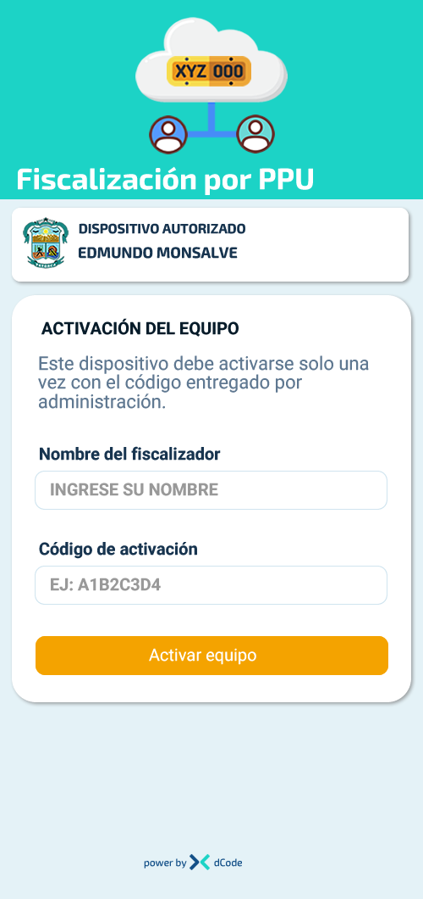
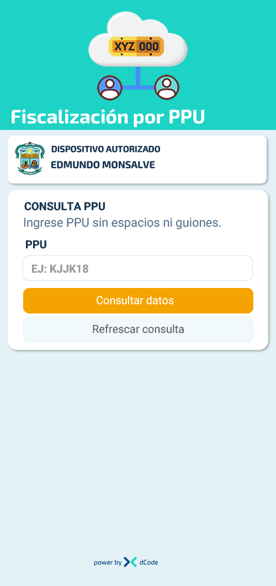

# Modificaciones al diseño gráfico App Fiscalización sin modificar la lógica que ya está funcionando
**/var/www/html/fiscalizacion**

## Esquema de color
Diseño gráfico basado en los colores corporativos (similar a /var/www/html/dintra).

| Color      | Código Hex |
| ---------- | ---------- |
| Primario   | #124f87    |
| Secundario | #1cd3c6    |

## Imágenes

1. Logo aplicación

2. Logo dCode

3. Logo Municipalidad de Petorca

## Estructura de las pantallas
* Color fondo pantalla: #E4F2F7
* Color títulos: #071C2A
* Color textos: #5F7891
* Botón principal
    - Color: #F4A300
    - Borde: #F4A300
    - Color texto: #ffffff 
    - Esquinas: redondeadas
* Botón auxiliar
    - Color: #F1F9FD
    - Borde: #E3F0F6
    - Color texto: #666666
    - Esquinas: redondeadas

* Área encabezado
    - Color de fondo: #1cd3c6 
    - ancho: 100%, alto 250px
    - Logo centrado, ancho: 180px, alto: 162px
    - Texto parametrizable, tamaño: 28px
    - Color de la fuente: #ffffff
* Área contenido *(Uno o más contenedores según necesidad)*
    - Color de fondo: #ffffff 
    - Contenido en contenedores 
        + Ancho 94% de la pantalla principal, centrado
        + Altura, según el contenido
        + Color de fondo: #ffffff
        + Esquinas redondeadas
        + sombra suave
* Área Pie de página
    - Color de fondo: #ffffff
    - Texto powered by {logoDC} dCode
    - Color fuente: #124f87
    - Tamaño fuente: pequeño

---

## Pantallas

1. Contenido pantalla de Enrolamiento
    * Encabezado 
    * Área de contenido
        - Recuadro identificación del dispositivo   
            + Columna 1 (izq) logo de la municipalidad, altura 60px
            + Columna 2 (der) Ocupa todo el espacio sobrante
                1. Linea uno  'DISPOSITIVO AUTORIZADO'
                2. Línea dos  {NOMBRE_DISPOSITIVO}
        - Recuadro ingreso de datos
            + Título: ACTIVACIÓN DEL EQUIPO 
            + Texto: Este dispositivo debe activarse solo una vez con el código entregado por administración.
            + Campo input:
                Título: Nombre del fiscalizador
                Placeholder: INGRESE SU NOMBRE
            + Campo input:
                Título: Código de activación
                Placeholder: EJ: A1B2C3D4
            + Botón
                Título: Activar equipo
                Tipo: Boton principal
    * Pie de página

2. Contenido Pantalla fiscalización
    * Encabezado 
    * Área de contenido
        - Recuadro identificación del dispositivo   
            + Columna 1 (izq) logo de la municipalidad, altura 60px
            + Columna 2 (der) Ocupa todo el espacio sobrante
                1. Linea uno  'DISPOSITIVO AUTORIZADO'
                2. Línea dos  {NOMBRE_DISPOSITIVO}
        - Recuadro ingreso de datos
            + Título: CONSULTA PPU
            + Texto: Ingrese PPU sin espacios ni guiones.
            + Campo input:
                Título: PPU
                Placeholder: EJ: KJJK18
            + Botón
                Value: Consultar datos
                Tipo: Boton principal    
            + Botón auxiliar
                Value: Refrescar consulta
                Tipo: Botón auxiliar
        - Recuadro Resumen General
            *Mantener gráfica estructura actual
        - Recuadro Permiso de circulación
            *Mantener gráfica estructura actual
        - Recuadro SOAP
            *Mantener gráfica estructura actual
        - Recuadro Revisión técnica
            *Mantener gráfica estructura actual
    * Pie de página

---

## OTRAS CONSIDERACIONES
* Aplicar un degradado tenue a fondo encabezados 
* Evitar que campos o botones queden pegados en el eje vertical
* Credenciales de acceso a los servidores **/var/www/html/@doc/doc_servidores.md**
* Registros DNS **/var/www/html/@doc/doc_registros_dns.md**

**Si se detectan faltas de ortografía o de digitación, corregirlas**

